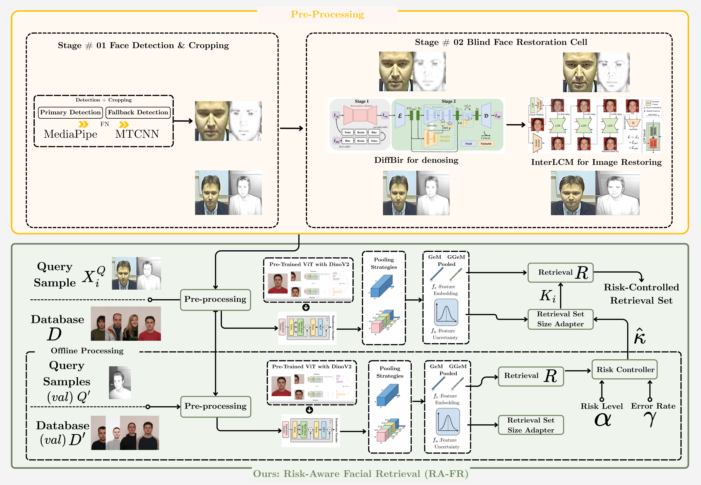

### A Step Forward Towards Risk Aware Facial Retrieval
Muhammad Emmad Siddiqui, Muhammad Rafi



### News 🔥

### Citation


### 0. Environment

- Ubuntu 24.04.3 LTS
- python 3.9 + PyTorch 2.0 + CUDA 11.7

### 1. Dataset

This research utilizes two face recognition datasets:

- IMFDB: Indian Movie Face Database
- Surveillance Cameras Face (SCFace) database

### IMFDB (Indian Movie Face Database)

The Indian Movie Face Database (IMFDB) is a large unconstrained face database consisting of 34,512 images of 100 Indian actors collected from more than 100 videos.

**Access:** The IMFDB dataset is **publicly available** and can be downloaded from:
[IMFDB Official Website](http://cvit.iiit.ac.in/projects/IMFDB/)

#### Data Preparation

The IMFDB dataset requires preparation before training. Follow these two steps:

**STEP 1: Organize Folder Structure**

Organize the raw IMFDB data by:
- Creating a unified `images/` folder
- Extracting all face images from movie-specific folders
- Organizing by PersonName subdirectories
- Each person's folder contains their face images from multiple movies

Run:
```bash
python preparation/step1_organize_folders.py --input_dir <raw_imfdb_path> --output_dir dbs/IMFDB
```

**STEP 2: Generate Metadata Files**

Generate the required metadata files (`image_class_labels.txt` and `images.txt`) from the organized structure:
- `images.txt`: Maps image IDs to relative paths (e.g., "1 PersonName/movie_frame.jpg")
- `image_class_labels.txt`: Maps image IDs to class labels (person IDs)

Run:
```bash
python preparation/step2_generate_metadata.py --data_dir dbs/IMFDB
```

After preparation, the final structure should be:
```
dbs
└── IMFDB
    ├── images/
    │   ├── PersonName1/
    │   │   ├── movie1_frame001.jpg
    │   │   └── movie1_frame002.jpg
    │   └── PersonName2/
    │       └── movie2_frame001.jpg
    ├── image_class_labels.txt
    └── images.txt
```

### SCFace Database

The Surveillance Cameras Face (SCFace) database is a face recognition dataset captured in uncontrolled indoor environments using surveillance cameras at various distances and angles.

**Access:** The SCFace database is **not publicly available**. To obtain access, please contact the authors and request permission through the official channels at the [University of Zagreb, Faculty of Electrical Engineering and Computing](http://www.scface.org/).

#### Data Preparation for SCFace

SCFace evaluation is performed both with and without data preparation to demonstrate the comparative results and the dominance of preparation in improving recognition performance. The two-stage preparation pipeline addresses the challenging surveillance camera conditions and consists of:

**Stage 1: Face Detection and Cropping (Combined Strategy)**

Due to the large size and challenging conditions of the SCFace dataset, we employ a combined detection strategy:

1. **Primary Detector - MediaPipe** ([google-ai-edge/mediapipe](https://github.com/google-ai-edge/mediapipe))
   - Fast and efficient face detection
   - Use for initial pass on all images
   
2. **Fallback Detector - MTCNN** ([ipazc/mtcnn](https://github.com/ipazc/mtcnn))
   - Handle false negatives from MediaPipe
   - More robust for challenging poses and lighting

**Stage 2: Blind Face Restoration**

Apply restoration methods based on detection results:

1. **DiffBIR** ([XPixelGroup/DiffBIR](https://github.com/XPixelGroup/DiffBIR))
   - **Aligned mode**: For successfully cropped faces from Stage 1
   - **Unaligned mode**: For non-cropped images (detection failures)
   - Performs Blind Image Denoising to enhance image quality
   
2. **InterLCM** ([sen-mao/InterLCM](https://github.com/sen-mao/InterLCM))
   - 3-step face restoration process
   - Apply after DiffBIR for final enhancement
   - **`has_aligned=True`**: Use for cropped faces (aligned images from Stage 1)
   - **`has_aligned=False`** (or omit): Use for non-cropped images (unaligned)

**Workflow:**
```bash
# 1. Face Detection & Cropping
# Run MediaPipe on SCFace dataset
# Run MTCNN on MediaPipe failures

# 2. Blind Face Restoration
# Apply DiffBIR (aligned) on cropped faces
# Apply DiffBIR (unaligned) on non-cropped images
# Apply InterLCM 3-step restoration on all outputs
```

**Note:** The processed SCFace images can then be evaluated using models trained on IMFDB (see Section 4: Eval).


### 2. Model Architectures

This repository supports three model architectures:

| Architecture | Description | Type |
|--------------|-------------|------|
| **R50-GeM** | ResNet50 + Generalized Mean Pooling | Baseline (from RCIR) |
| **ViTB-DN-GeM** | Vision Transformer Base + Dino Pretrained + GeM | Proposed | **Proposed**
| **ViTB-DN-GGeM** | Vision Transformer Base + Dino Pretrained + Group GeM | **Proposed (Main)** |

To select an architecture, modify the `arch` parameter in your config files or use command-line override:

```bash
# Method 1: Edit conf/train/btl.yaml or conf/train/mcd.yaml
arch: ViTB-DN-GGeM  # Options: R50-GeM, ViTB-DN-GeM, ViTB-DN-GGeM

# Method 2: Command-line override
py run.py train=btl dataset=imfdb train.arch=ViTB-DN-GGeM
py run.py train=mcd dataset=imfdb train.arch=ViTB-DN-GeM
```

### 3. Train

```python
py run.py train=[model] dataset=imfdb # `[train]=mcd|btl`
e.g.,
py run.py train=btl dataset=imfdb
py run.py train=btl dataset=imfdb train.arch=ViTB-DN-GGeM  # Use proposed architecture
```

### 4. Eval

**IMFDB Evaluation:**
```python
py run.py train=[model] test=[model] dataset=imfdb test.ckpt.imfdb=[xxx.ckpt] # `[train]=[test]=mcd|btl`
e.g.,
py run.py train=btl test=btl dataset=imfdb test.ckpt.imfdb=logs_beta/btl_imfdb_0515_072333/RAFR/xxx/checkpoints/best.ckpt
```

**SCFace Cross-Dataset Evaluation:**

To evaluate models trained on IMFDB on the SCFace dataset:

1. **Preprocess SCFace** following the two-stage pipeline in Section 1 (SCFace Data Preparation)
2. **Use IMFDB-trained checkpoint** to evaluate on preprocessed SCFace images:
   ```python
   # Ensure SCFace dataset is properly configured
   py run.py train=[model] test=[model] dataset=scface test.ckpt.scface=[imfdb_trained.ckpt]
   # e.g.,
   py run.py train=btl test=btl dataset=scface test.ckpt.scface=logs_beta/btl_imfdb_0515_072333/RAFR/xxx/checkpoints/best.ckpt
   ```

This cross-dataset evaluation tests the model's generalization from controlled movie scenes (IMFDB) to surveillance camera conditions (SCFace).

### 5. Apply RAFR

(Make sure you have completed **Eval**)

You may need to modify the runs folder in `baselines.json`, then run:

```shell
#!/bin/bash
for i in {0..9}
do
    cnt=$i
    py rafr.py --unc=[model] --dbs=imfdb --cnt=$cnt --basic & 
    # `[model]=mcd|btl|ensemble`
    # e.g.,
    # py rafr.py --unc=btl --dbs=imfdb --cnt=$cnt --basic &  
done
wait
```
